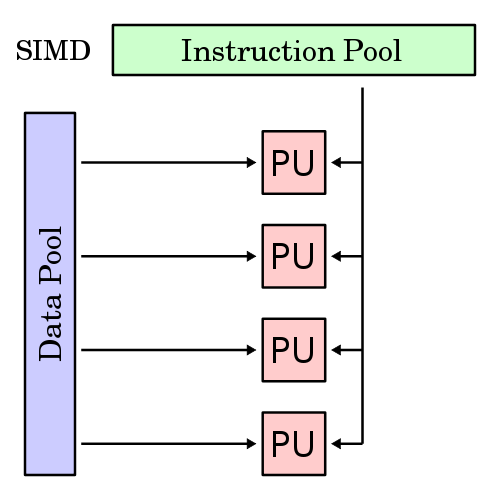

# Lecture 16 — Mostly Data Parallelism

## Roadmap

We will talk about SIMD and a case study of it.

## Two ideas

Data parallelism: performing *the same* operations on different input

Task parallelism: is performing *different* operations on different input.

## Single-Instruction Multiple-Data (SIMD)

<!--  -->

In the lecture note ...

```rust
// main.rs

pub fn foo(a: &[f64], b: &[f64], c: &mut [f64]) {
    for ((a, b), c) in a.iter().zip(b).zip(c) {
        *c = *a + *b;
    }
}
```

Without optimization

```asm
; rustc 1.75.0
; line 758-760 on godbolt
movsd   xmm0, qword ptr [rdx]
addsd   xmm0, qword ptr [rcx]
movsd   qword ptr [rax], xmm0
```

With optimization (opt-level=3)

```asm
movupd  xmm0, xmmword ptr [rdi + 8*rsi]
movupd  xmm1, xmmword ptr [rdi + 8*rsi + 16] ; seems like a delay slot
movupd  xmm2, xmmword ptr [rdx + 8*rsi]
addpd   xmm2, xmm0
movupd  xmm0, xmmword ptr [rdx + 8*rsi + 16]
addpd   xmm0, xmm1
movupd  xmmword ptr [r8 + 8*rsi], xmm2
movupd  xmmword ptr [r8 + 8*rsi + 16], xmm0
```

Exercise: try to use <https://godbolt.org/> to explore the `foo` function. You
can also compile `main.rs` on ece machines with and without SIMD by yourselves
using the following commands.

```bash
# on ecetesla
rustc -o with_simd.s    --emit asm -Cllvm-args=--x86-asm-syntax=intel --crate-type rlib main.rs
rustc -o with_simd_o3.s --emit asm -Cllvm-args=--x86-asm-syntax=intel --crate-type rlib -C opt-level=3 main.rs
rustc -o without_simd.s --emit asm -Cllvm-args=--x86-asm-syntax=intel --crate-type rlib -C opt-level=3 -C target-feature=-sse main.rs
```

Question: what can be an issue with SIMD? How to deal with it in Rust? (Answers
are in the lecture note)

## Live-coding

```rust
/*

// not runnable on rust explorer

[dependencies]
simdeez = "1.0.8"
*/

// https://github.com/jackmott/simdeez

use simdeez::*;
use simdeez::scalar::*;
use simdeez::sse2::*;
use simdeez::sse41::*;
use simdeez::avx2::*;

simd_runtime_generate!(
// assumes that the input sizes are evenly divisible by VF32_WIDTH
pub fn add(a:&[f32], b: &[f32]) -> Vec<f32> {
  let len = a.len();
  let mut result: Vec<f32> = Vec::with_capacity(len);
  result.set_len(len);
  for i in (0..len).step_by(S::VF32_WIDTH) {
    let a0 = S::loadu_ps(&a[i]);
    let b0 = S::loadu_ps(&b[i]);
    S::storeu_ps(&mut result[0], S::add_ps(a0, b0));
  }
  result
});

fn main() {
  let a : [f32; 4] = [1.0, 2.0, 3.0, 4.0];
  let b : [f32; 4] = [5.0, 6.0, 7.0, 8.0];

  unsafe {
    println!("{:?}", add_sse2(&a, &b))
    // ^ add_sse2 is generated
  }
}
```

## Stream VByte

On the board, construct the inverted index from the notes.

Next challenge: storing the deltas. Ask students to write
VByte encodings of a few examples. Show the binary representation
of the examples on the board.

Finally, illustrate how "shuffle" works by having a student tell
other students where to put their data in a 128-bit output.
Ask students to work through examples of decoding numbers
written with the Stream VByte separation of control and data.

# After-action report, plam, 27 Feb 2023

I did the first example in godbolt and talked about the generated code
to some extent.

There could have been a flipped classroom activity for data and task parallelism.

I think I'll also do poor man's SIMD as a constructed exercise in
class on Friday.

After live coding the simdeez example, it should be easy enough
to have students implement \sum a_i * b_i. Change the + to a * and
add a second loop that adds result. Maybe rename result to c and
then have a scalar result.

# After-action report, plam, 3 Mar 2023

Tried again with poor-man's SIMD on the board, then worked through
Stream VByte example. Did not have students work through examples but
was somewhat interactive. Did do the SSE example as live coding.

# After-action report, huanyi, 09Feb24

I went through all the things, but by just giving lectures. I didn't do the
living coding since RustExplorer does work for it anymore. I didn't do Stream
VByte activity, either.
